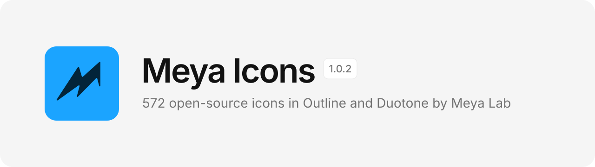
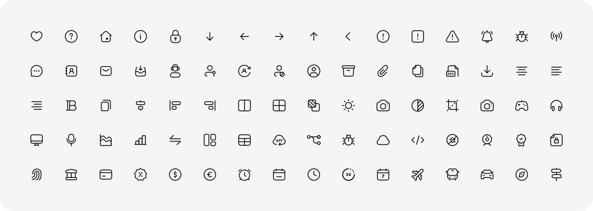
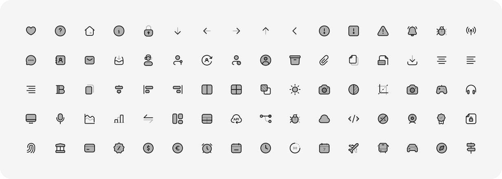

<picture>
  <source media="(prefers-color-scheme: dark)" srcset="./assets/banner-dark.svg">
  
</picture>

# Meya Icons

Meya Icons is a free, open-source set of <!--count-->287<!--/count--> icons drawn by [Meya Lab](https://meyalab.com), in <!--stylenames-->**Outline** and **Duotone**<!--/stylenames--> styles. Every icon sits on a 24 × 24 grid with a 1.3 px stroke and round caps and joins, and uses `currentColor`, so it picks up the text color around it.

[](#categories)
[](https://github.com/nazmijavier/meya-icons/releases)
[](./LICENSE)

**[Browse the icons](https://nazmijavier.github.io/meya-icons/)** · **[Download ZIP](https://github.com/nazmijavier/meya-icons/releases/latest/download/meya-icons-1.0.zip)** · **[Hire Meya Lab](https://meyalab.com/contact)**

<!--previews-->
<picture>
  <source media="(prefers-color-scheme: dark)" srcset="./assets/preview-outline-dark.svg">
  
</picture>

<picture>
  <source media="(prefers-color-scheme: dark)" srcset="./assets/preview-duotone-dark.svg">
  
</picture>
<!--/previews-->

## Styles

<!--styles-->
| Style | Icons | Look |
| --- | ---: | --- |
| [Outline](./icons/outline) | 287 | 1.3 px strokes only |
| [Duotone](./icons/duotone) | 285 | The same strokes, plus a 30% tint fill for depth |
| Sharp | Coming soon | Strokes with square caps and mitered corners |
| Filled | Coming soon | Solid shapes for active and selected states |
<!--/styles-->

Every style uses `currentColor`. Duotone tints use `fill-opacity`, so both tones follow the one color you set.

## Get the icons

- **Copy one icon.** Open the [website](https://nazmijavier.github.io/meya-icons/), choose a style, search, pick an icon, and copy it as SVG or as a React component. You can change the stroke width and size before you copy.
- **Download the whole set.** Get the [ZIP from the latest release](https://github.com/nazmijavier/meya-icons/releases/latest/download/meya-icons-1.0.zip). The SVG files are in [`icons/`](./icons), one folder per style, then per category.
- **Clone it.**

  ```bash
  git clone https://github.com/nazmijavier/meya-icons.git
  ```

## Usage

### HTML

Paste the SVG inline. The icon takes the color of its parent.

```html
<button style="color: #1BA4FF">
  <svg xmlns="http://www.w3.org/2000/svg" width="24" height="24" viewBox="0 0 24 24" fill="none">
    <!-- paths from icons/outline/general/home.svg -->
  </svg>
  Home
</button>
```

### React

Copy the React version from the website, or import the file with an SVG loader such as SVGR:

```jsx
// home.svg copied from icons/outline/general/
import HomeIcon from "./icons/home.svg?react";

<HomeIcon className="text-neutral-900" width={20} height={20} />
```

### Figma

Drag any SVG from [`icons/`](./icons) onto the canvas. Strokes and tints stay editable.

## Design specs

| Property | Value |
| --- | --- |
| Grid | 24 × 24 px |
| Live area | 20 × 20 px (2 px padding) |
| Stroke | 1.3 px, centered |
| Caps and joins | Round |
| Color | `currentColor` |

## Categories

<!--categories-->
| Category | Outline | Duotone |
| --- | ---: | ---: |
| General | [15](icons/outline/general) | [15](icons/duotone/general) |
| Arrows | [15](icons/outline/arrows) | [15](icons/duotone/arrows) |
| Alerts & Feedback | [15](icons/outline/alerts-feedback) | [15](icons/duotone/alerts-feedback) |
| Communication | [15](icons/outline/communication) | [15](icons/duotone/communication) |
| Users | [15](icons/outline/users) | [15](icons/duotone/users) |
| Files | [15](icons/outline/files) | [15](icons/duotone/files) |
| Editor | [15](icons/outline/editor) | [15](icons/duotone/editor) |
| Layout | [15](icons/outline/layout) | [15](icons/duotone/layout) |
| Images | [15](icons/outline/images) | [15](icons/duotone/images) |
| Media & Devices | [15](icons/outline/media-devices) | [15](icons/duotone/media-devices) |
| Charts | [15](icons/outline/charts) | [15](icons/duotone/charts) |
| Development | [15](icons/outline/development) | [15](icons/duotone/development) |
| Security | [15](icons/outline/security) | [15](icons/duotone/security) |
| Finance & E-commerce | [15](icons/outline/finance-ecommerce) | [15](icons/duotone/finance-ecommerce) |
| Time | [15](icons/outline/time) | [15](icons/duotone/time) |
| Maps & Travel | [16](icons/outline/maps-travel) | [15](icons/duotone/maps-travel) |
| Education | [15](icons/outline/education) | [15](icons/duotone/education) |
| Weather | [16](icons/outline/weather) | [15](icons/duotone/weather) |
| Shapes | [15](icons/outline/shapes) | [15](icons/duotone/shapes) |
<!--/categories-->

## Adding icons

1. Export the new icons from Figma as SVG. Name each file `category-name.svg`, for example `weather-sun.svg` or `Icon=weather-sun.svg`.
2. Import them into `icons/`. Pass `--style` for anything other than Outline (`duotone`, `sharp` or `filled`):

   ```bash
   node scripts/import.mjs ~/path/to/exports
   node scripts/import.mjs ~/path/to/duotone-exports --style duotone
   node scripts/import.mjs ~/path/to/sharp-exports --style sharp
   node scripts/import.mjs ~/path/to/filled-exports --style filled
   ```

3. Rebuild the website, the README images and the icon counts:

   ```bash
   node scripts/build.mjs
   ```

The website is a single file at [`docs/index.html`](./docs/index.html), served by GitHub Pages.

## License

Meya Icons is released under the [MIT License](./LICENSE). You can use it in personal and commercial projects. Credit is appreciated but not required.

---

<a href="https://meyalab.com">
  <picture>
    <source media="(prefers-color-scheme: dark)" srcset="./assets/wordmark-white.svg">
    
  </picture>
</a>

Made by [Meya Lab](https://meyalab.com), a design studio that builds brands, websites and apps. Need a custom icon set? [Hire us](https://meyalab.com/contact).
